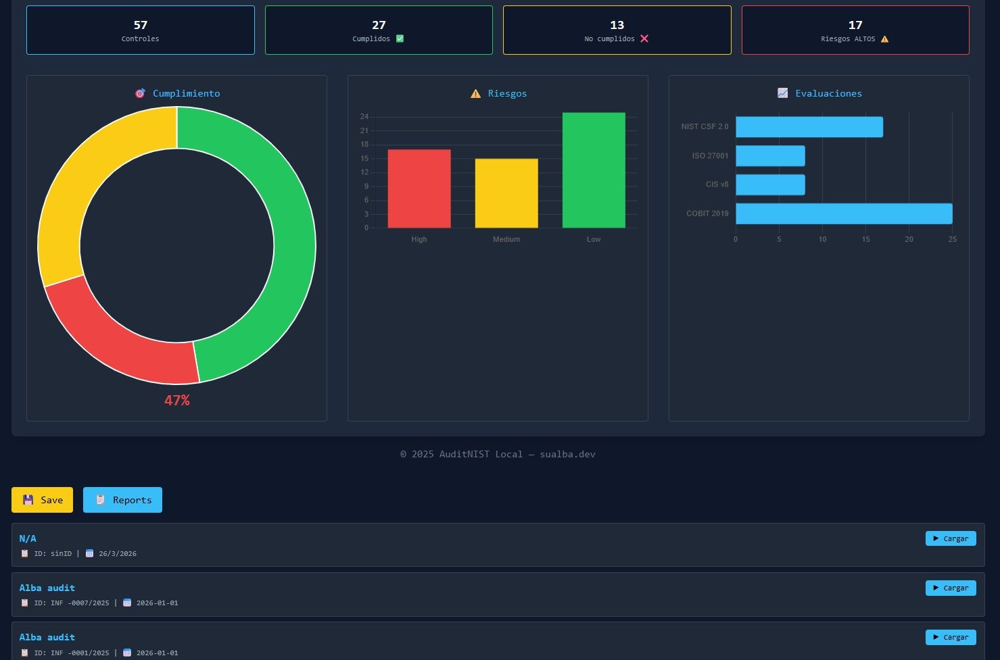
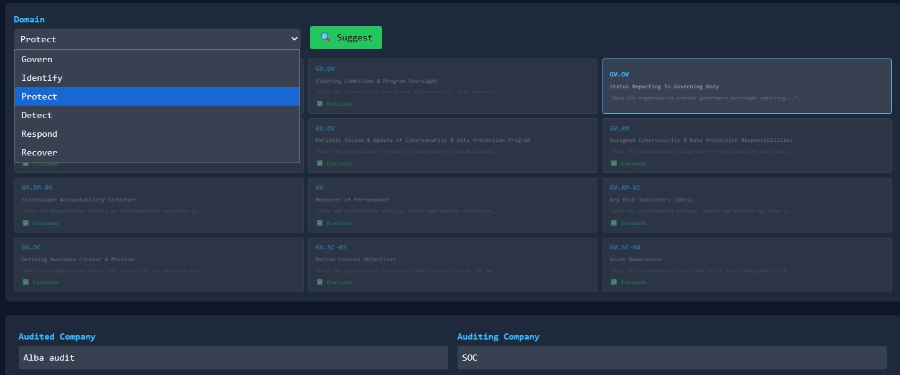
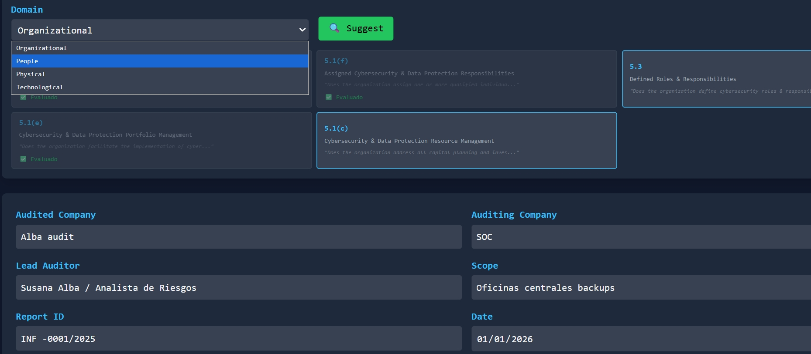
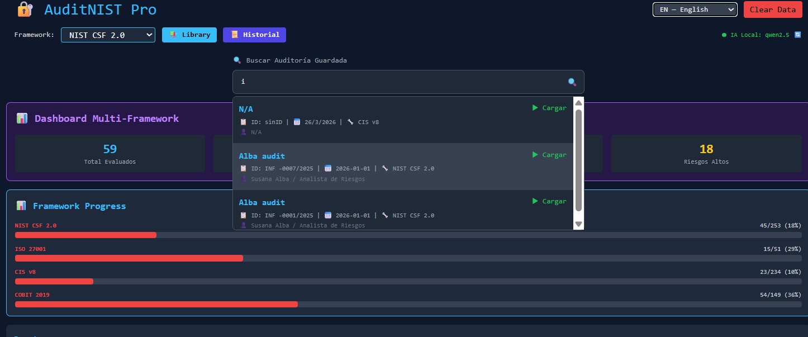
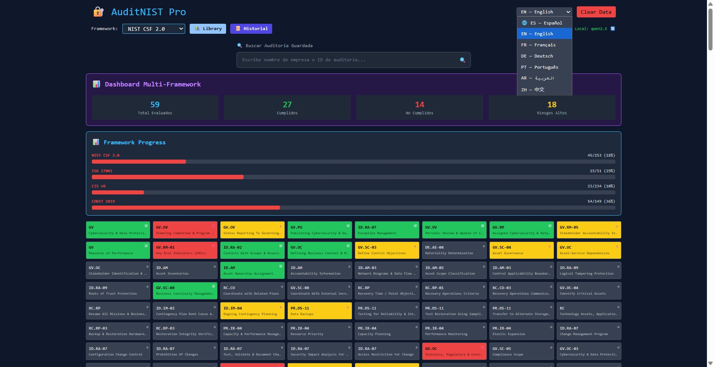
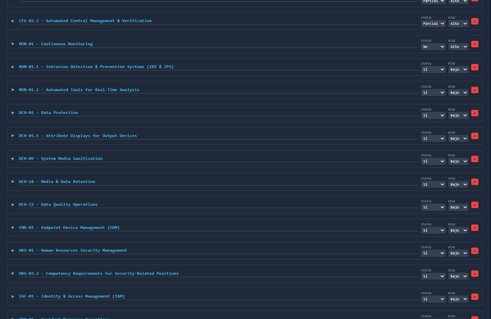
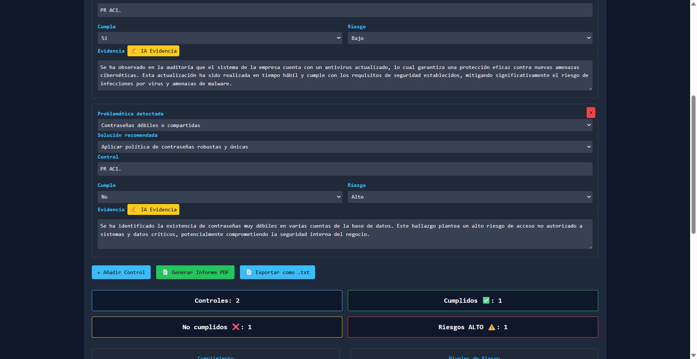

# 🔐 AuditNIST Pro

> **Local-first multi-framework cybersecurity audit workspace**  
> Built to help auditors, security teams, and compliance professionals perform structured assessments with clarity, speed, and visual insight.

AuditNIST Pro is an evolving cybersecurity audit workspace that brings together **control evaluation, risk visibility, evidence tracking, reusable templates, and reporting** in a single interface.

It currently supports:

- **NIST CSF 2.0**
- **ISO 27001**
- **CIS Controls v8**
- **COBIT 2019**

---
## 🤝 Collaboration

AuditNIST Pro is actively developed with contributions from:

- **Susana Alba Santamaria** — Project Creator  
- **Vandan Panwala** — Main Collaborator & Architecture Contributor  

GitHub: https://github.com/PanwalaVandan

## Why this project stands out

Cybersecurity frameworks are powerful, but in practice they are often:

- difficult to operationalize
- fragmented across documents
- repetitive to assess
- hard to visualize in a clean workflow

**AuditNIST Pro** aims to turn that complexity into a more practical experience:

- evaluate controls
- classify compliance
- score risk
- document evidence
- reuse controls
- export results
- compare framework progress

All from a **local-first workspace**, with no backend required for the core workflow.

---

## 📸 Interface Preview

### Multi-Framework Dashboard



A visual overview of audit activity across frameworks, with summary metrics, compliance visibility, and risk-oriented monitoring.

---

### AI-Assisted Evidence Workflow


Designed to support a more efficient audit process with structured evidence handling and auditor-oriented documentation flow.

---

### Suggested Controls by Domain



Framework-aware control suggestions help speed up audit preparation and make the workflow more practical.

---

### Framework Domain Selection



Controls can be explored from a domain perspective, making the tool easier to use for real audit sessions.

---

### Framework Progress Tracking



Progress bars make it easier to see evaluation coverage across NIST, ISO, CIS, and COBIT at a glance.

---

### Control Grid Overview



A more visual control map helps identify evaluated items and improves audit readability.

---

### Framework Control Workspace



The main workspace is built around practical control handling: compliance, risk, notes, and evidence.

---

### Reporting View



AuditNIST Pro is designed to support structured reporting and a cleaner audit output workflow.

---

## ✨ Current Features

### Multi-framework support

- NIST CSF 2.0
- ISO 27001
- CIS Controls v8
- COBIT 2019

### Audit workspace

- Control evaluation
- Compliance classification
- Risk rating
- Auditor notes
- Evidence tracking
- Suggested controls
- Reusable templates

### Dashboard and analytics

- Compliance overview
- Risk visualization
- Framework progress
- Multi-framework comparison
- Audit metrics

### Reporting and portability

- PDF export
- JSON export/import
- Local audit history
- Structured metadata handling

### Local-first design

- No backend required
- Standalone usage possible
- LocalStorage persistence
- Lightweight deployment model

---

## 🎯 Who this is for

### Auditors and compliance professionals

- Cybersecurity auditors
- Internal audit teams
- GRC professionals
- Compliance specialists

### Security teams

- SOC analysts
- Security engineers
- Risk analysts
- Security consultants

### Contributors

- Frontend developers
- Security-minded builders
- Open-source collaborators
- People interested in audit tooling, compliance UX, and security product ideas

---

## 🧠 Project Vision

AuditNIST Pro is evolving toward a more structured and practical cybersecurity audit platform focused on:

- multi-framework assessments
- reusable audit logic
- cross-framework thinking
- better visualization of compliance and risk
- more efficient audit documentation
- future AI-assisted audit workflows

This is **not yet a finished product**, but it is already more than a simple demo or checklist. It is an active workspace moving toward a clearer product direction.

---

## 🤝 How to Contribute

AuditNIST Pro welcomes contributors at different levels.

Whether you want to improve the interface, refine the logic, or help shape the architecture, there is room to contribute.

### 🟢 Level 1 — Quick Contributions

Good starting tasks:

- [ ] Improve UI spacing
- [ ] Improve control card layout
- [ ] Improve dashboard styling
- [ ] Improve responsiveness
- [ ] Improve chart readability
- [ ] Improve template library UI
- [ ] Improve accessibility
- [ ] Improve dark mode consistency

### 🔵 Level 2 — Core Improvements

More technical contributions:

- [ ] Refactor Audit Engine
- [ ] Improve control data model
- [ ] Improve evaluation persistence
- [ ] Improve dashboard calculations
- [ ] Improve import/export logic
- [ ] Improve state management
- [ ] Improve performance with large audits

### 🟣 Level 3 — Advanced Ideas

Future-oriented contributions:

- [ ] Cross-framework mapping engine
- [ ] Maturity scoring model
- [ ] Risk scoring engine
- [ ] Control normalization
- [ ] Audit recommendation engine
- [ ] AI audit assistant

---

## 🏗️ Architecture Direction

AuditNIST Pro is evolving toward a structure built around:

- Audit Engine
- Framework Adapters
- Evaluation Registry
- Template Library
- Reporting Engine
- AI Layer

This direction makes the project easier to grow and easier for contributors to work on independently.

---

## 🛣️ Roadmap

### Phase 1 — Foundation
- Multi-framework support
- Dashboard
- Audit controls
- Reporting
- Local persistence

### Phase 2 — Structure
- Cleaner modular architecture
- Better control model
- Improved persistence and audit flow
- Better contributor experience

### Phase 3 — Intelligence
- Cross-framework mapping
- Risk scoring improvements
- Smarter suggestions
- AI-assisted audit workflows

---

## 🛠️ Tech Stack

- HTML
- Tailwind CSS
- JavaScript
- Chart.js
- jsPDF
- FileSaver.js
- LocalStorage

---

## 🛣️ Roadmap

See full roadmap:  
📄 ROADMAP.md

---
## 🚀 Running the Project

Open directly:

```bash
open auditnist-local.html

Or run a local server:

python -m http.server 8080
📌 Project Status

Active development — evolving toward a structured cybersecurity audit workspace.

AuditNIST Pro is currently in a strong pre-product phase: usable, visible, and growing.


# 👥 Core Contributors

### 👩‍💻 Author
**Susana Alba Santamaria**  
Cybersecurity & Audit-Focused Builder  
📧 sualba.dev@gmail.com

### 🤝 Main Collaborator
**Vandan Panwala**  
Cybersecurity & Software Engineering Contributor  
🔗 https://github.com/PanwalaVandan

License

MIT License

⭐ Support the Project
If you find this project useful:

give the repository a star ⭐
open issues for improvements
contribute new framework adapters