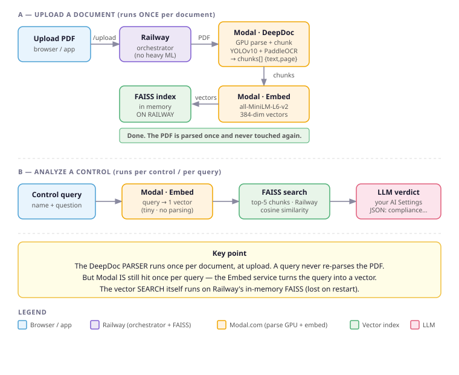

# AuditSym RAG — service boundaries (what runs where)

Companion to [`pipeline-overview.md`](pipeline-overview.md). That doc explains
the steps; this one answers **which service does each step, and how often** —
the questions that get re-asked every time someone (or an LLM) picks this up.

## Two deployments

- **Local desktop** (`start.bat` → `rag/server.py` + `rag/embedder.py`, RAG on
  `localhost:8765`): parse, chunk, embed, index, and search **all run locally**
  via `sentence-transformers`. **Modal is not involved at all.**
- **Cloud** (Railway, `deploy/server.py`): Railway is a *thin orchestrator* that
  does **no heavy ML itself**. It calls two Modal services and holds the index.

The rest of this doc is the **cloud** path.

## Who does what

| Step | Service | Runs how often |
|------|---------|----------------|
| Parse PDF + chunk | **Modal · DeepDoc** (GPU: YOLOv10 + PaddleOCR), `PARSER_SERVICE_URL/parse` | **Once per document**, at upload |
| Embed chunks → 384-dim vectors | **Modal · Embed** (`all-MiniLM-L6-v2`, CPU), `EMBED_SERVICE_URL/embed` | Once per document (batched, `EMBED_BATCH=512`) |
| Build / hold the vector index | **Railway** — in-memory FAISS (`IndexFlatIP`), keyed by `session_id` | — |
| Embed the query text | **Modal · Embed** (same model) | **Once per control/query** |
| Vector search (top-K similar chunks) | **Railway** — FAISS `index.search` | Once per control/query |
| Control verdict (JSON) | **Your LLM** from AI Settings (Ollama `qwen2.5:3b`, or configured provider) — **not Modal** | Once per control |

Code: upload/parse/embed/store + query = `deploy/server.py` (`_process_job`,
`/query`). Query-time prompt = `buildControlAnalysisPrompt()` in
`ui/auditnist-local.html`.

## The two questions people keep asking

**"Does it re-parse the whole document on every query?"**
No. The DeepDoc **parser runs exactly once per document, at upload.** A query
never re-parses the PDF. The heavy GPU cost is a one-time-per-document cost.

**"Is Modal called on a query, or never?"**
Modal **is** called on every query — but only the cheap **Embed** service, to
turn the query string into one vector (~milliseconds, no parsing). The
**parser** is never called at query time. (A generic RAG diagram that embeds via
OpenAI would say "Modal never called on query"; that does not apply here,
because our embedder is *also* on Modal.)

**"Where does the actual search happen?"**
On **Railway**, against its in-memory FAISS index. Only the query-embedding
hops out to Modal; the nearest-neighbour search is local Railway CPU.

## Important caveats

- **The FAISS index is in-memory on Railway and per-session** (`_stores[session_id]`).
  It is **not** a persistent database (no SQLite/pgvector). A Railway
  restart/redeploy drops it — after that, `/query` returns `{chunks: []}` and the
  document must be re-uploaded.
- **Auth:** the whole Railway site is behind HTTP Basic Auth; the two Modal
  endpoints are separately bearer-token gated. Secrets come only from env vars
  (`PARSER_SERVICE_URL/SECRET`, `EMBED_SERVICE_URL/SECRET`, `BASIC_AUTH_USER/PASS`).
- **The Auto-Analyze prompt is English-only** (hardcoded in
  `buildControlAnalysisPrompt()`), so verdict notes/evidence come back in English
  regardless of the UI language.
- Data-retention / classification / multi-user login are open items — see the
  "Notes for later" in `pipeline-overview.md`.

## The per-control prompt (grounding contract)

`buildControlAnalysisPrompt()` sends the control + audit question + the **top-5
retrieved chunks** and instructs the model to answer **"Based ONLY on the
excerpts above"** and **"never invent facts"**, returning strict JSON
(`compliance`, `risk`, `notes`, `evidence`). If nothing relevant is retrieved,
the excerpts block reads *"No relevant excerpts found."* and the expected answer
is `no` / *"Not evidenced in provided documentation."* Retrieval quality (top-5)
is therefore the accuracy ceiling: a control can read as `no`/`partial` because
the relevant passage was not retrieved, not because the document lacks it.
